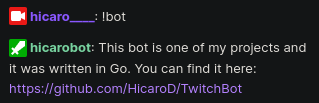

# TwitchBot

🤖 A chat bot for my [Twitch channel](https://www.twitch.tv/hicaro____) written in Go.

**This bot is still not deployed**

## Commands
| Command      | Description                                                                             | Is it implemented? |
|--------------|-----------------------------------------------------------------------------------------|--------------------|
| `!commands`  | List of commands                                                                        | :heavy_check_mark: |
| `!bot`       | Description of the bot, technologies that I used, author and link to GitHub repository. | :heavy_check_mark: |
| `!socials`   | My socials.                                                                             | :heavy_check_mark: |
| `!me`        | A little description about me                                                           | :heavy_check_mark: |
| `!projects`  | List of open source projects that I built                                               | :heavy_check_mark: |
| `!today`     | What am I doing today?                                                                  | :heavy_check_mark: |
| `!colors`    | Name of the color scheme I'm currently using                                            | :heavy_check_mark: |

## License
This project is licensed under the [MIT](./LICENSE) license.
